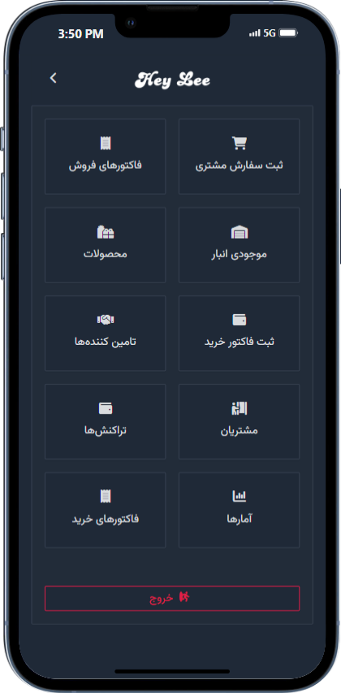

# Hey Lee

An all-in-one inventory management and accounting application designed specifically for small online stores. This Angular project simplifies the complexities of managing sales, expenses, investments, and inventory, making it ideal for both solo entrepreneurs and small teams.


## Table of Contents

- [About the Project](#about-the-project)
- [Features](#features)
- [Built With](#built-with)
- [Getting Started](#getting-started)
  - [Prerequisites](#prerequisites)
  - [Installation](#installation)
  - [Running the Application](#running-the-application)
- [Usage](#usage)
- [Screenshots](#screenshots)
- [Roadmap](#roadmap)
- [Contributing](#contributing)
- [License](#license)
- [Contact](#contact)
- [Acknowledgments](#acknowledgments)

## About the Project

Managing accounting and inventory for small online stores can be intricate, especially for one-person operations. This application aims to streamline these processes by providing an integrated solution for managing customers, transactions, inventory, and more. It bridges the gap between different departments, making coordination seamless for team-managed stores as well.

## Features

- **Customers Management**
  - Central hub for adding, editing, and viewing customer details.
- **Transactions Overview**
  - Comprehensive view of all financial transactions, including expenses, investments, and business dealings.
- **Purchase Invoices**
  - Dedicated section for tracking and managing purchase invoices, crucial for brokerage businesses.
- **Record Purchase Invoice**
  - Straightforward tool for creating new purchase invoices.
- **Suppliers Directory**
  - Manage suppliers and their associated information.
- **Record Customer Orders**
  - Streamlined process for creating customer orders with quick selection of existing customers.
  - Auto-populates customer details and performs real-time inventory checks.
- **Inventory Management**
  - Real-time view of current stock levels.
- **Product Catalog**
  - Manage product information, including adding, editing, and deleting products.
- **Statistics and Analytics**
  - Detailed sales analytics, including daily sales and product-specific performance metrics.

## Built With

- [Angular v18]([https://angular.dev/])
- [TypeScript](https://www.typescriptlang.org/)
- [Ant Design of Angular](https://ng.ant.design/docs/introduce/en)
- [Tailwind CSS](https://tailwindcss.com/)

## Getting Started

To get a local copy up and running, follow these simple steps.

Install Angular CLI globally if you haven't:

```bash
npm install -g @angular/cli
```

### Installation

1. **Clone the repository**

   ```bash
   git clone https://github.com/hamedaravane/heylee-front.git
   ```

2. **Navigate to the project directory**

   ```bash
   cd heylee-front
   ```

3. **Install dependencies**

   ```bash
   npm install
   ```

### Running the Application

1. **Start the development server**

   ```bash
   ng serve
   ```

2. **Open the application in your browser**

   Navigate to `http://localhost:4200/` in your web browser.

## Usage

- **Customers Domain**
  - Navigate to the **Customer** section to add, edit, or view customer details.
- **Transaction Domain**
  - Access the **Transaction** section to monitor all financial transactions.
- **Purchase Domain**
  - Use the **Purchase** section to track and manage your invoices and also Create new purchase invoices.
- **Supplier Domain**
  - Manage your suppliers in the **Supplier** section.
- **Inventory**
  - View current stock levels in real-time in the **Inventory** section.
- **Product**
  - Manage your product catalog in the **Product** section.
- **Statistic**
  - Access detailed sales analytics in the **Statistic** section.

## Screenshots

### Dashboard



## License

Distributed under the MIT License. See `LICENSE` file for more information.

## Contact

- **Author**: Hamed Arghavan
- **Email**: [hamedaravane@gmail.com](mailto:hamedaravane@gmail.com)
- **GitHub**: [hamedaravane](https://github.com/hamedaravane)

Project Link: [https://github.com/hamedaravane/heylee-front](https://github.com/hamedaravane/heylee-front)

## Acknowledgments

- [Angular Documentation](https://angular.dev/docs)
- [TypeScript Documentation](https://www.typescriptlang.org/docs/)
- [Ant Design of Angular](https://ng.ant.design/docs/introduce/en)
- [Tailwind CSS](https://tailwindcss.com/)
- [RxJS Documentation](https://rxjs.dev/guide/overview)
- [Font Awesome](https://fontawesome.com/) for icons
